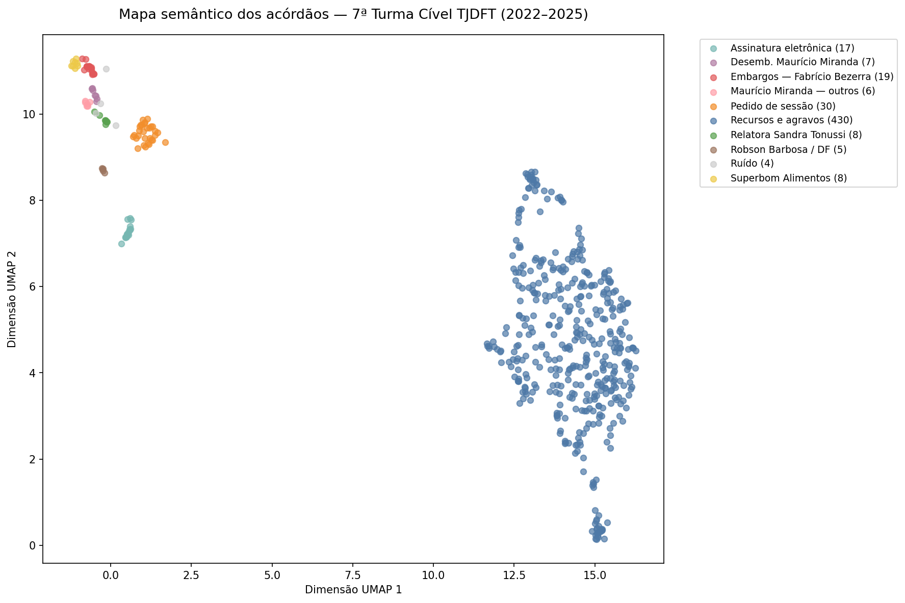
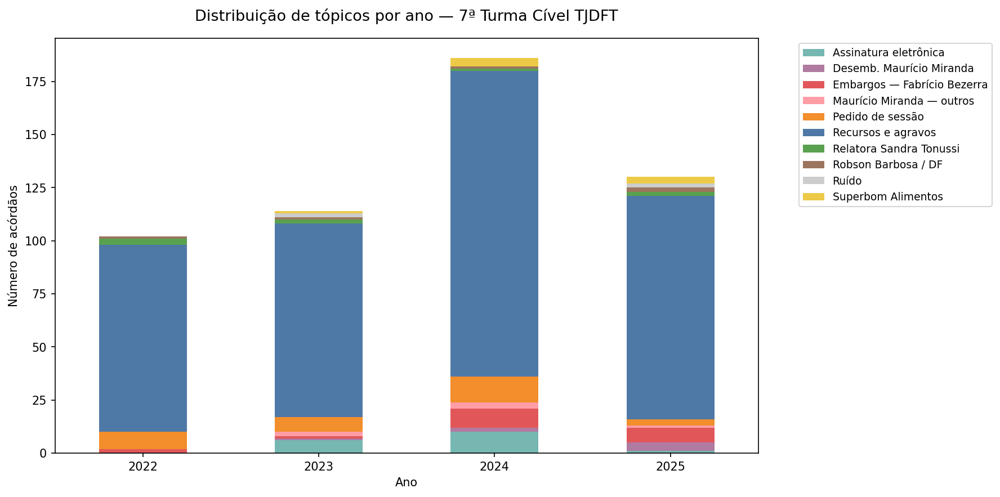

# Análise de Tópicos em Acórdãos do TJDFT

Pipeline de PLN não supervisionado aplicado a 606 acórdãos da **7ª Turma Cível** do Tribunal de Justiça do Distrito Federal e dos Territórios, coletados via API oficial para o período de **2022 a 2025**.

## Pergunta central

> Quais padrões temáticos emergem das decisões da 7ª Turma Cível do TJDFT entre 2022 e 2025, e eles são consistentes ao longo do tempo?

## Pipeline

| Etapa | Descrição | Biblioteca |
|-------|-----------|------------|
| 1 | Coleta via API REST do TJDFT | requests |
| 2 | Pré-processamento do texto jurídico | re |
| 3 | Embeddings semânticos | BERTimbau (neuralmind/bert-base-portuguese-cased) |
| 4 | Modelagem de tópicos | BERTopic, UMAP, HDBSCAN |
| 5 | Visualização e análise temporal | matplotlib |

## Resultados

9 tópicos identificados. Coeficiente de Silhueta: **0.1388**.





## Arquivos

| Arquivo | Descrição |
|---------|-----------|
| `projeto_pln_tjdft.ipynb` | Notebook principal com todo o pipeline |
| `coletar_acordaos_tjdft.py` | Script de coleta via API do TJDFT |
| `acordaos_com_topicos.csv` | Corpus com tópicos atribuídos |
| `embeddings_acordaos_v2.npy` | Embeddings gerados pelo BERTimbau |
| `mapa_semantico_acordaos.png` | Mapa 2D dos acórdãos por tópico |
| `distribuicao_temporal_topicos.png` | Distribuição de tópicos por ano |
| `roteiro_tjdft_publico.docx` | Documentação técnica do projeto |

## Como executar

```bash
# Instalar dependências
pip install transformers torch bertopic umap-learn hdbscan pandas matplotlib

# Abrir o notebook
jupyter notebook projeto_pln_tjdft.ipynb
```

## Projeto

Projeto Final — Disciplina de Deep Learning e PLN  
IDP — Instituto de Direito Público · Turma 1/2026 